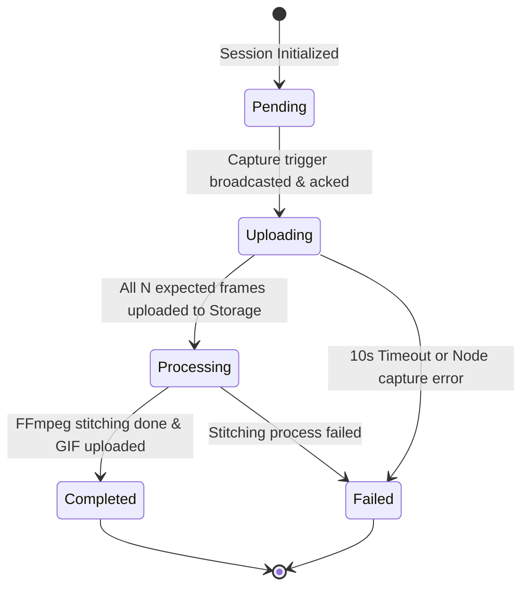

# Data Model: Distributed Multi-Camera Photo Booth

## Cloud State (Firestore)

### Collection: `sessions`

Each capture session is represented by a document under the `sessions` collection with a unique `sessionId` (e.g., UUIDv4 or KSUID).

```typescript
interface SessionDocument {
  id: string;                               // Unique session identifier
  status: 'pending' | 'uploading' | 'processing' | 'completed' | 'failed';
  expectedFrames: number;                   // The expected number of camera frames for this session (between 3 and 10)
  uploadedFrames: {                         // Maps camera index to Storage file path
    [cameraIndex: string]: string;          // e.g., "1": "raw/session123/cam1.jpg"
  };
  gifUrl?: string;                          // Stitched GIF download URL (available on completion)
  createdAt: admin.firestore.Timestamp;     // Creation timestamp
  updatedAt: admin.firestore.Timestamp;     // Last update timestamp
  errorMessage?: string;                    // Populated on failure
}
```

---

## Local State (Go Coordinator)

The Go coordinator maintains client node state in memory to manage connections, synchronize triggers, and track session status.

### Client Node Registry

```go
type ClientNode struct {
	Index        int           `json:"index"`        // 1 to 10
	IPAddress    string        `json:"ip_address"`
	ConnectedAt  time.Time     `json:"connected_at"`
	IsReady      bool          `json:"is_ready"`
	ClockOffset  time.Duration `json:"clock_offset"`  // Offset from coordinator time (NTP)
	BatteryLevel int           `json:"battery_level"`  // 0 to 100
	State        string        `json:"state"`         // "idle" | "capturing" | "uploading" | "uploaded" | "error"
}
```

### Connection Types

```go
type ConnectionType string

const (
	ConnCamera   ConnectionType = "camera"
	ConnOperator ConnectionType = "operator"
)
```

### Coordinator Session State

```go
type CaptureSession struct {
	SessionID string            `json:"session_id"`
	Status    string            `json:"status"` // "ready" | "triggered" | "done"
	StartedAt time.Time         `json:"started_at"`
	Nodes     map[int]*ClientNode
}
```

---

## Email Sharing Model

### Collection: `sessions/{sessionId}/shares`

For tracking guest sharing delivery attempts:

```typescript
interface ShareDocument {
  id: string;                               // Unique share identifier
  email: string;                            // Guest email address
  status: 'pending' | 'sent' | 'failed';
  sentAt?: admin.firestore.Timestamp;       // Populated on successful delivery
  errorMessage?: string;                    // Populated on failure
}
```

---

## State Transition Workflow


